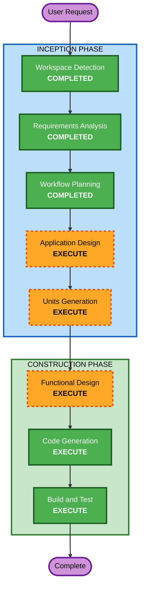

# Execution Plan

## Detailed Analysis Summary

### Change Impact Assessment
- **User-facing changes**: Yes - 고객 주문 UI 및 관리자 대시보드 전체 신규 구현
- **Structural changes**: Yes - 모듈형 모놀리스 아키텍처 전체 설계 및 구현
- **Data model changes**: Yes - 9개 엔티티 신규 설계 (Store, AdminUser, Table, TableSession, Category, MenuItem, Order, OrderItem, OrderHistory)
- **API changes**: Yes - 전체 REST API 신규 설계 + SSE 실시간 통신
- **NFR impact**: Yes - JWT 인증, bcrypt, SSE 2초 이내 전달, 동시접속 50 테이블

### Risk Assessment
- **Risk Level**: Medium
- **Rollback Complexity**: Easy (Greenfield - 롤백 불필요)
- **Testing Complexity**: Moderate (API 통합 테스트 + SSE 실시간 검증)

---

## Workflow Visualization



### Text Alternative
```
Phase 1: INCEPTION
  - Workspace Detection (COMPLETED)
  - Requirements Analysis (COMPLETED)
  - Workflow Planning (COMPLETED)
  - Application Design (EXECUTE)
  - Units Generation (EXECUTE)

Phase 2: CONSTRUCTION
  - Functional Design (EXECUTE, per-unit)
  - Code Generation (EXECUTE, per-unit)
  - Build and Test (EXECUTE)
```

---

## Phases to Execute

### INCEPTION PHASE
- [x] Workspace Detection (COMPLETED)
- [x] Requirements Analysis (COMPLETED)
- [x] Workflow Planning (IN PROGRESS)
- [ ] Application Design - **EXECUTE**
  - **Rationale**: 신규 프로젝트로 6개 백엔드 모듈(auth, store, menu, order, table, sse) 및 프론트엔드 컴포넌트 구조, API 엔드포인트, 서비스 레이어 설계가 필요
- [ ] Units Generation - **EXECUTE**
  - **Rationale**: 복합 시스템으로 다수 모듈 간 의존성 파악 및 구현 단위 분해 필요

### CONSTRUCTION PHASE
- [ ] Functional Design - **EXECUTE** (per-unit)
  - **Rationale**: 9개 엔티티 데이터 모델, 주문 생성/세션 관리 등 비즈니스 로직 상세 설계 필요
- [ ] NFR Requirements - **SKIP**
  - **Rationale**: 기술 스택 이미 확정됨, NFR이 requirements.md에 명확히 정의됨
- [ ] NFR Design - **SKIP**
  - **Rationale**: NFR Requirements 스킵으로 인해 해당 없음
- [ ] Infrastructure Design - **SKIP**
  - **Rationale**: Docker Compose 기반 단순 인프라, 복잡한 클라우드 설계 불필요. 코드 생성 단계에서 docker-compose.yml 직접 작성
- [ ] Code Generation - **EXECUTE** (per-unit, ALWAYS)
  - **Rationale**: 전체 구현 코드 생성 (백엔드 API, 프론트엔드 UI, DB 스키마, Docker 설정)
- [ ] Build and Test - **EXECUTE** (ALWAYS)
  - **Rationale**: 빌드 및 테스트 지침 생성

### OPERATIONS PHASE
- [ ] Operations - **PLACEHOLDER**
  - **Rationale**: 향후 배포/모니터링 워크플로우용 예약

---

## Skipped Stages Summary

| Stage | Reason |
|-------|--------|
| Reverse Engineering | Greenfield 프로젝트 |
| User Stories | 사용자가 스킵 선택, 요구사항 문서가 충분히 상세 |
| NFR Requirements | 기술 스택 확정됨, NFR 요구사항 명확히 정의됨 |
| NFR Design | NFR Requirements 스킵 |
| Infrastructure Design | Docker Compose 단순 구성, Code Generation에서 처리 |

---

## Estimated Timeline
- **Total Stages to Execute**: 5 (Application Design → Units Generation → Functional Design → Code Generation → Build and Test)
- **Estimated Interactions**: 7~10회 (각 단계별 계획/승인 포함)

## Success Criteria
- **Primary Goal**: 단일 매장용 테이블오더 MVP 완성
- **Key Deliverables**:
  - 백엔드 API 서버 (Node.js + Express + TypeScript)
  - 프론트엔드 SPA (React + Vite + TypeScript)
  - PostgreSQL 데이터베이스 스키마 (Prisma)
  - Docker Compose 개발 환경
  - 단위 테스트 + API 통합 테스트
- **Quality Gates**:
  - 모든 API 엔드포인트 정상 동작
  - SSE 실시간 주문 알림 2초 이내
  - 고객 주문 플로우 E2E 정상 동작
  - 관리자 모니터링 대시보드 정상 동작
